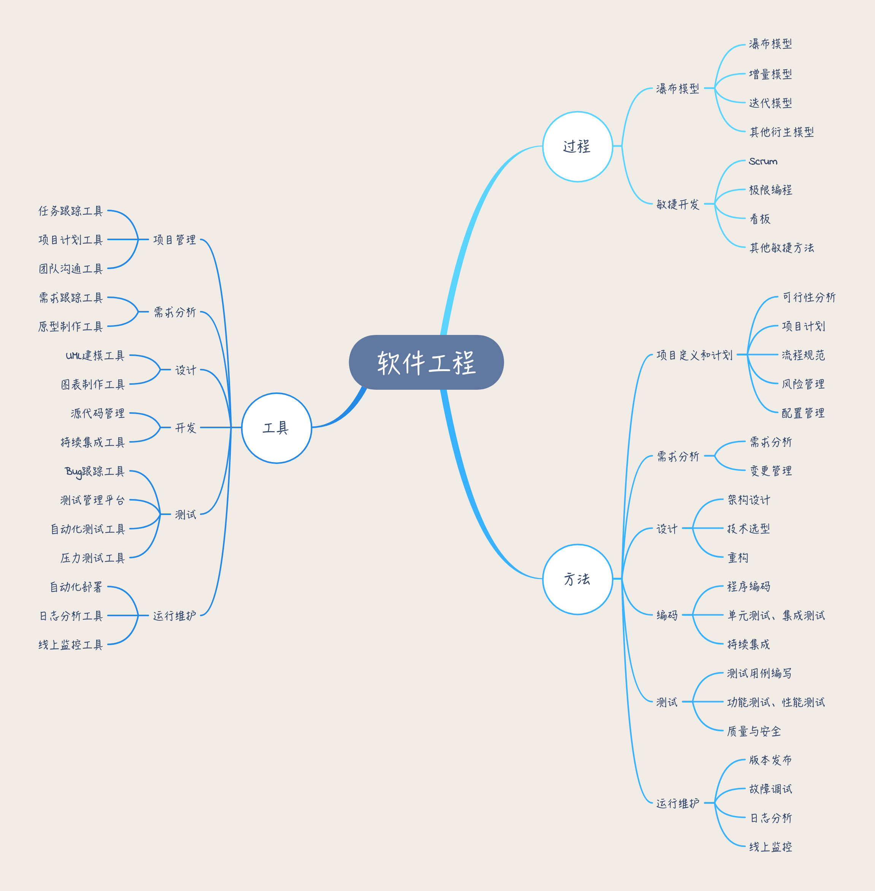
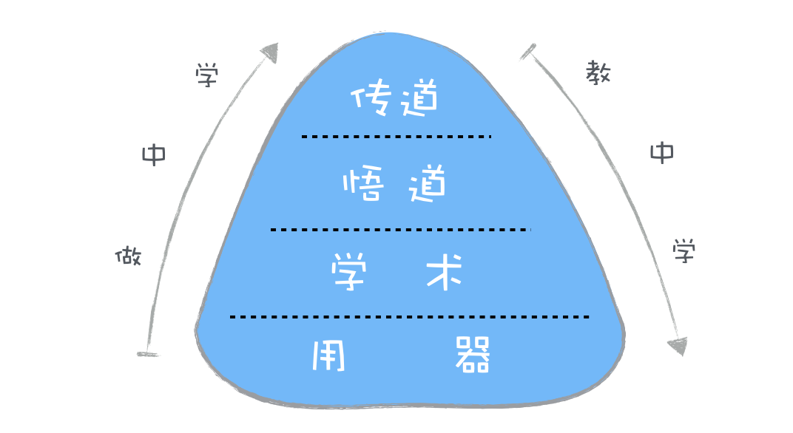

我们的专栏会从<strong>“道、术、器”</strong>三个维度来讲解软件工程的知识内容。

<ul>
<li>“器”就是软件工程中的各种工具。</li>
<li>“术”就是软件工程中的各种方法。例如如何做需求分析？如何对需求变更做变更管理？</li>
<li>“道”就是软件工程知识的核心思想、本质规律。例如为什么要有需求分析？需求变更产生的深层次原因是什么？项目中决策的依据是什么？</li>
</ul>

###下面的需要特别注意

“软件工程”和“质量工程”需要依靠架构技术，而不是依靠 CMM 和 QA 管理流程。一切工程问题，首先要思考能否通过技术解决，当前技术无法解决的问题，暂时由管理手段代劳，同时不停止寻找技术手段。

<strong>软件工程 = 工具 + 方法 + 过程。</strong>

软件工程的知识结构图

#1. 如何学

在学习本专栏的时候，你可以采用“做中学”的方式，把专栏中的知识应用起来，在实践的过程中去巩固你学到的知识，去思考背后的道。把已经积累的项目经验和软件工程的知识点关联起来，这样才能加深你的理解，学以致用，把经验和知识转化为能力。

--
教中学： 
比如，你学习完一篇专栏文章后，把学到的知识进行输出，写成微博或博客分享出去；在公司内部讲给你的同事们听等。在教学分享的过程中，去进一步深化吸收知识内容，构建你的知识体系。
